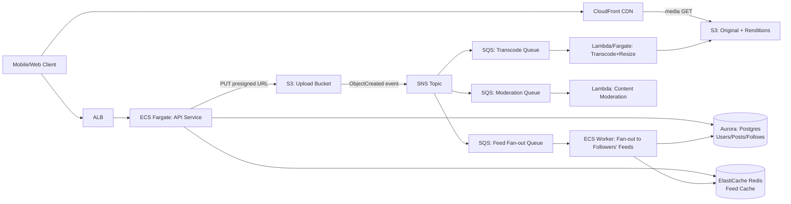

# Module 17: Cloud Architecture (AWS + Multi-Cloud)

## Core Concepts

### Compute: EC2, ECS, Lambda

**EC2** is raw virtual machines — you own the OS, patching, scaling, and placement. Choose it when you need specific instance types (GPU, high-memory, bare-metal-like control), custom kernel modules, licensing that requires dedicated hosts, or long-running stateful processes that don't fit a container/function model well (e.g., self-managed databases, legacy monoliths). Auto Scaling Groups + Launch Templates give you elastic fleets, but you still manage AMIs, patch cycles, and instance health.

**ECS (Elastic Container Service)** runs containers without you managing a Kubernetes control plane. Two launch types matter: **EC2 launch type** (you manage the underlying instances, ECS just schedules tasks onto them — cheaper at high, steady utilization) and **Fargate** (serverless containers — AWS manages the host, you pay per vCPU/GB-second of task runtime, no capacity planning). Choose ECS/Fargate for microservices, APIs, and background workers where you want container portability and simpler ops than EKS. Choose EKS instead only when you need Kubernetes-specific ecosystem tooling (Helm charts, operators, multi-cloud portability) — it adds real operational overhead (control plane version upgrades, CNI/IAM plumbing) that ECS avoids.

**Lambda** is event-driven, stateless, short-lived (max 15 min) compute billed per invocation/duration. It shines for: bursty or unpredictable traffic, glue code between services (S3 event → process → write to DynamoDB), thin API backends behind API Gateway, and async workers pulling off SQS. It's the wrong choice for long-running jobs, workloads needing GPU, or ultra-low and consistent p99 latency at very high sustained RPS (cold starts, concurrency limits, and per-ms billing make it more expensive than ECS at steady high volume).

**Rule of thumb:** predictable steady-state traffic + full control → EC2/ECS(EC2). Container-based microservices without wanting to run infra → ECS/Fargate. Spiky, event-driven, low-average-utilization workloads → Lambda.

### Storage: S3, RDS, ElastiCache

**S3** is the default answer for object storage: durable (11 nines), unlimited scale, tiered storage classes (Standard → Intelligent-Tiering → Glacier) for lifecycle-based cost optimization, and native event notifications (S3 → SQS/SNS/Lambda) that make it a first-class citizen in async pipelines. Anything binary and large — images, video, backups, logs, data lake files — belongs in S3, not in a database blob column.

**RDS** (Postgres/MySQL/Aurora) is for structured, relational, transactional data — anything needing ACID guarantees, joins, and strong consistency: user accounts, post metadata, relationships. Aurora specifically buys you storage that auto-scales up to 128TB, faster failover (~30s), and read replicas that share the same underlying storage layer (no replication lag on the storage tier itself, though replicas can still lag on apply). Choose Aurora over vanilla RDS when you need higher throughput/availability and can accept the modest cost premium; choose DynamoDB instead when your access pattern is key-based lookups at massive scale with no complex joins.

**ElastiCache** (Redis or Memcached) sits in front of RDS to absorb read load and serve sub-millisecond lookups: session storage, feed caches, rate-limit counters, leaderboards. Redis wins almost by default now because it supports richer data structures (sorted sets for feeds/leaderboards, pub/sub, persistence options) versus Memcached's pure key-value simplicity. The core pattern is cache-aside (read cache → miss → read DB → populate cache) with a TTL, plus explicit invalidation on writes for anything where staleness is unacceptable.

### VPC Networking

A VPC is your isolated network. **Public subnets** have a route to an Internet Gateway (IGW) and host resources that need direct inbound internet access — ALBs, NAT gateways, bastion hosts. **Private subnets** have no direct route to the IGW; their outbound internet access (for package installs, calling external APIs) goes through a **NAT Gateway** sitting in a public subnet — the NAT gateway has an Elastic IP, and private-subnet route tables point `0.0.0.0/0` at it. This is the standard shape: internet-facing load balancer in public subnets, application servers/containers and databases in private subnets, NAT gateway for private→internet egress only (nothing can initiate inbound to a private subnet from the internet).

**Security groups vs NACLs** is a classic interview distinction:
- **Security groups** are stateful, attached to instances/ENIs, and only support *allow* rules (default deny). Return traffic is automatically permitted regardless of outbound rules. You use them as your primary, fine-grained access control — e.g., "only the ALB's security group can reach port 8080 on the app tier's security group."
- **NACLs** are stateless, attached to subnets, and support both *allow* and *explicit deny* rules evaluated in rule-number order. Because they're stateless, you must explicitly allow both the inbound request and the outbound response (including ephemeral ports 1024-65535). Their main practical value is as a coarse, subnet-wide safety net — e.g., explicitly blocking a known-bad CIDR range regardless of what any security group says.

In practice: security groups do almost all the real work; NACLs are mostly left at their default "allow all" and used surgically for blocklisting or defense-in-depth compliance requirements.

### Load Balancers: ALB vs NLB

**ALB (Application Load Balancer)** operates at Layer 7 (HTTP/HTTPS/gRPC). It understands the request: it can route by path (`/api/*` vs `/images/*`), host header, or headers/query strings to different target groups; it terminates TLS, does content-based routing, WebSocket support, and integrates natively with WAF, Cognito authentication, and ECS/Fargate service discovery. Use ALB whenever you're routing HTTP traffic to multiple backend services or need L7 features like path-based routing, redirects, or fixed responses.

**NLB (Network Load Balancer)** operates at Layer 4 (TCP/UDP/TLS passthrough). It doesn't parse the request — it just forwards packets — which gives it ultra-low latency, the ability to handle millions of requests per second, static IP addresses per AZ (useful for allow-listing), and preservation of the client's source IP. Use NLB for non-HTTP protocols (raw TCP, gRPC over pure TCP without L7 routing needs, MQTT, custom binary protocols), extreme throughput/low-latency requirements (trading systems, gaming), or when you need a static IP for firewall allow-listing that ALB can't give you.

**Interview framing:** default to ALB for web/API traffic because you almost always want path/host routing eventually; reach for NLB only when you have a concrete reason (protocol isn't HTTP, need static IPs, need to shave off the last milliseconds of L7 overhead, or need to preserve client IP without proxy headers).

### SQS and Asynchronous Communication Patterns

SQS decouples producers from consumers via a durable queue, which is the core tool for turning a synchronous chain of failures into an async, resilient pipeline. Two queue types: **Standard** (at-least-once delivery, best-effort ordering, nearly unlimited throughput) and **FIFO** (exactly-once processing, strict ordering per message group, capped throughput ~3,000 msg/s with batching). Key patterns:

- **Queue-based load leveling**: a burst of writes (e.g., 10,000 uploads in a minute) is absorbed by the queue so downstream workers can drain it at a sustainable rate instead of the origin service falling over.
- **Dead-letter queues (DLQ)**: after N failed processing attempts, a message is moved to a DLQ for inspection instead of retrying forever or being silently dropped.
- **Fan-out via SNS→SQS**: an SNS topic publishes once, and multiple SQS queues subscribe, so one event (e.g., "photo uploaded") can trigger independent consumers (thumbnail generation, content moderation, search indexing) without coupling them to each other.
- **Visibility timeout**: a consumer that pulls a message gets an exclusive lease; if it doesn't delete the message before the timeout expires, another consumer can pick it up — this is what makes retries safe but also means processing must be idempotent.

This is the backbone of "decouple upload from processing" architectures: the API only needs to accept the file and enqueue a job, returning fast; the actual (slow, failure-prone) transcoding/resizing happens asynchronously and can be scaled and retried independently.

### Infrastructure as Code with Terraform

Terraform declares infrastructure as versioned, reviewable code instead of manual console clicks. Fundamentals:

- **Providers** (`aws`, `google`, etc.) are plugins that translate HCL resources into API calls.
- **State** (`terraform.tfstate`) is the source of truth mapping declared resources to real-world IDs; for team use it must live in a remote backend (S3 + DynamoDB for state locking) so two engineers can't corrupt it concurrently.
- **Modules** are reusable, parameterized bundles of resources (e.g., a "vpc" module, an "ecs-service" module) — the same pattern as functions, letting you compose a full environment from a handful of well-tested building blocks.
- **Plan/apply workflow**: `terraform plan` computes a diff between desired and actual state before anything changes, giving you a reviewable, dry-run diff — critical for safe changes in production.
- Multi-cloud fit: Terraform's provider model is what makes it the standard choice over cloud-native tools (CloudFormation, ARM templates) when an organization runs across AWS + GCP/Azure, since the same workflow and state model apply regardless of provider.

### Best Practices and Cost Optimization

- **Right-size compute**: match instance/task size to actual CPU/memory utilization (CloudWatch metrics), use Compute Savings Plans or Reserved Instances for steady-state baseline load, and Spot Instances for interruption-tolerant batch/async work (can cut compute cost 60-90%).
- **Storage lifecycle policies**: auto-transition S3 objects from Standard → Infrequent Access → Glacier based on age/access patterns; this alone is often the single biggest storage cost lever on media-heavy systems.
- **Use a CDN aggressively**: CloudFront in front of S3 both improves latency (edge caching close to users) and reduces origin egress costs, since cache hits never touch S3 data transfer pricing.
- **Serverless where traffic is spiky**: Lambda/Fargate avoid paying for idle capacity; reserve EC2/always-on ECS for steady, predictable load where the per-unit cost is lower.
- **Multi-AZ, not multi-region, by default**: multi-AZ gives you the availability most systems need at a fraction of the operational and cost complexity of active-active multi-region; reserve multi-region for genuine global-latency or regulatory requirements.
- **Tag everything** for cost allocation, and set AWS Budgets/Cost Anomaly Detection alerts so runaway spend (a mis-scaled Lambda, an unbounded NAT gateway data-transfer bill) is caught within a day, not a billing cycle.

---

## Case Study Solution: Instagram-style Media Platform on AWS

### Problem Statement & Clarifying Requirements

Design a media-sharing platform where users upload photos/videos, follow other users, and view a chronological/ranked feed of posts from people they follow, at global scale.

**Functional requirements**
- Upload photo/video with caption; media is processed into multiple resolutions/renditions.
- Generate and serve a feed of posts from followed accounts.
- View a single post, view a user's profile grid.
- (Out of scope for this module, but acknowledged): likes, comments, DMs, recommendation-ranked feed ML.

**Non-functional requirements**
- Read-heavy: feed reads vastly outnumber uploads (roughly 100:1 to 1000:1 in real social platforms).
- Low-latency global delivery of media (P99 image load < 200ms from a nearby edge).
- High availability (feed must degrade gracefully, never hard-fail).
- Durability of media (uploaded video/photos must never be lost).
- Eventual consistency acceptable for feed (a post can take a few seconds to appear for followers).

### Capacity Estimation

Assume 500M monthly active users, 100M daily active users (DAU).

- **Uploads**: 1 in 20 DAU uploads a post/day → 5M uploads/day ≈ 58 uploads/sec average, ~10x peak ≈ 600/sec at peak.
- **Reads**: each DAU loads ~20 feed screens/day, each screen ~10 posts → 200 post-views/user/day × 100M = 20B feed item reads/day ≈ 230K reads/sec average, several-hundred-K/sec peak — this is why the read path is CDN + cache dominated, not database dominated.
- **Storage per upload**: assume avg 2MB photo, plus 4 generated renditions (thumbnail, small, medium, original) ≈ 5MB stored per upload. 5M uploads/day × 5MB ≈ 25TB/day ≈ ~9PB/year of raw media — squarely S3's use case, with lifecycle tiering to Glacier for old, rarely-accessed originals.
- **Metadata**: a post row is small (~1KB with references) — 5M/day × 1KB ≈ 5GB/day of relational metadata, trivial for RDS/Aurora, but the *fan-out* writes for feed materialization (below) are the real scaling concern.

### High-Level Architecture



**VPC layout (public/private subnets, NAT):**

```
VPC (10.0.0.0/16), 3 AZs for HA
├── Public subnets (10.0.0.0/24, .1.0/24, .2.0/24)
│     - ALB ENIs, NAT Gateway (one per AZ), IGW route
├── Private app subnets (10.0.10.0/24, .11.0/24, .12.0/24)
│     - ECS Fargate tasks (API, workers), route 0.0.0.0/0 -> NAT GW
└── Private data subnets (10.0.20.0/24, .21.0/24, .22.0/24)
     - Aurora, ElastiCache — no route to internet at all
```

Internet → IGW → ALB (public subnet) → ECS tasks (private app subnet, reached only via the ALB's security group) → Aurora/ElastiCache (private data subnet, reached only from the app tier's security group). Outbound calls from the app tier (e.g., third-party APIs, package pulls) go app-subnet → NAT gateway → IGW. The data subnets have no NAT route at all — they cannot reach or be reached from the internet under any circumstance, which is both a security requirement and often a compliance one.

### API Design

```
POST /v1/posts/upload-url
  Request:  { contentType: "image/jpeg" }
  Response: { postId, uploadUrl (S3 presigned PUT), expiresIn }

POST /v1/posts
  Request:  { postId, caption, mediaKey }
  Response: { postId, status: "processing" }
  # Client calls this after the S3 upload succeeds; this is what
  # actually creates the post metadata row and kicks off async processing.

GET /v1/feed?cursor={cursor}&limit=20
  Response: { posts: [{ postId, authorId, mediaUrls: {thumb, medium, original}, caption, createdAt }], nextCursor }

GET /v1/users/{userId}/posts?cursor={cursor}&limit=30
  Response: { posts: [...] }  # profile grid, same shape
```

Upload is split into two calls deliberately: `upload-url` gets a presigned S3 URL so the (large) binary payload goes **directly to S3**, never through the API tier — this is the single biggest scalability win in the design, since the ECS fleet never has to buffer multi-hundred-MB video bodies.

### Data Model

```
users(id PK, username UNIQUE, display_name, created_at)

follows(follower_id FK, followee_id FK, created_at, PK(follower_id, followee_id))
  -- indexed on followee_id for "who follows me" fan-out lookups

posts(id PK, author_id FK, caption, status ENUM('processing','ready','failed'),
      created_at, media_key)  -- media_key points at the S3 canonical object

media_renditions(id PK, post_id FK, rendition_type ENUM('thumb','small','medium','original'),
                  s3_key, width, height, format)

feed_entries(user_id FK, post_id FK, author_id FK, created_at,
             PK(user_id, created_at, post_id))
  -- one row per (follower, post) pair, written at fan-out time;
  -- this is the "fan-out on write" materialized feed table/cache
```

`posts` + `media_renditions` live in Aurora Postgres (relational, low volume, needs joins for profile pages). `feed_entries` is the fan-out table — for a normal user (fan-out on write) this is a Redis sorted set keyed by `user_id` with score = timestamp, so `GET /feed` is a single `ZREVRANGE` — O(log N) — rather than a query across all followees' posts at read time.

### Deep Dive

**ALB vs NLB for this system.** ALB is the correct choice for the public-facing entry point: all client traffic is HTTPS/HTTP2 REST, and the platform needs path-based routing (`/v1/posts/*` vs `/v1/feed/*` can route to different target groups if the org later splits services), TLS termination at the edge, and native integration with AWS WAF to block abusive scraping/upload bots — none of which NLB provides. NLB would only enter this design if we exposed a raw TCP/gRPC ingestion service directly (e.g., a dedicated high-throughput video-upload protocol bypassing HTTP), and even then most teams put that behind CloudFront + S3 presigned URLs instead, avoiding the extra load balancer entirely. So: ALB in front of the API/ECS tier, no NLB needed for the core flow.

**VPC/security group/NACL design.** Three-tier subnet layout (public/app/data) as diagrammed above. Security groups do the real enforcement: `sg-alb` allows 443 from `0.0.0.0/0`; `sg-app` allows its port only from `sg-alb`; `sg-data` (Aurora, Redis) allows its port only from `sg-app`. This means even if an attacker compromises a public-facing instance, the database is unreachable except through the exact app-tier security group — instance IP addresses are irrelevant, and the rule survives autoscaling since it's SG-to-SG, not IP-to-IP. NACLs are left permissive by default at the subnet level, with one explicit deny rule for known bad CIDR ranges as defense-in-depth, since duplicating all the SG logic statelessly at the NACL layer buys little extra protection for a lot of operational complexity.

**How SQS decouples upload from processing.** The API's job on `POST /v1/posts` is just: write a `posts` row with `status='processing'`, and return immediately (target: <100ms). It does **not** wait for transcoding, moderation, or feed fan-out — those all happen off an SNS fan-out into three independent SQS queues. This buys three things: (1) the API tier's latency and availability are decoupled from the transcoding tier's (a transcoding backlog never makes uploads time out); (2) each consumer scales independently — Lambda/ECS workers reading the transcode queue can scale based on queue depth (CloudWatch `ApproximateNumberOfMessagesVisible` → target-tracking scaling policy) without touching the API tier at all; (3) failures are isolated and retryable — a failed moderation Lambda invocation doesn't lose the message, it becomes visible again after the visibility timeout, and after N failures lands in a DLQ for manual inspection, rather than silently dropping the post or crashing the request.

**Terraform module structure (sketch).**

```
infra/
├── modules/
│   ├── vpc/            # subnets, IGW, NAT GWs, route tables
│   ├── security/       # security groups, NACLs, WAF rules
│   ├── alb/             # ALB, target groups, listeners
│   ├── ecs-service/     # reusable: task def, service, autoscaling policy
│   ├── rds-aurora/      # cluster, parameter group, subnet group
│   ├── elasticache/     # redis replication group
│   ├── s3-media/        # buckets, lifecycle policies, CloudFront OAC
│   └── sqs-sns/         # topics, queues, DLQs, subscriptions
└── envs/
    ├── staging/main.tf   # instantiates modules with staging-sized params
    └── prod/main.tf      # instantiates modules with prod-sized params, remote S3+DynamoDB state backend
```

Each module exposes inputs (instance sizes, counts, CIDR ranges) and outputs (ARNs, endpoint DNS names) so `envs/prod` wires them together declaratively; `terraform plan` against the prod workspace is required and reviewed before any `apply`.

### Trade-offs and Alternatives Considered

- **Fan-out on write vs fan-out on read**: materializing every follower's feed at post time (chosen above) makes reads O(1) but is expensive for celebrity accounts with millions of followers (a single post triggers millions of writes). The real-world fix (used by Twitter/Instagram-scale systems) is a **hybrid**: fan-out on write for normal users, fan-out on read (merge celebrity posts into the feed at request time) for accounts above a follower threshold.
- **ECS Fargate vs Lambda for transcoding**: Lambda's 15-minute limit and memory ceiling make it workable for photos and short clips but awkward for long-form video transcoding; a real system routes large video jobs to Fargate/Batch and keeps Lambda for lightweight image resizing.
- **DynamoDB vs Aurora for feed storage**: DynamoDB (partition key = user_id, sort key = timestamp) is a defensible alternative to Redis+Aurora for feed_entries at very high scale, trading Redis's lower read latency for DynamoDB's fully-managed durability and no cache-warm concerns after a restart.
- **Multi-region**: not included above for cost/complexity reasons; a genuinely global product would add S3 Cross-Region Replication and Aurora Global Database, at meaningfully higher operational and dollar cost, justified only once cross-region latency or regulatory data-residency actually bites.

### How Real Systems Solve This

Instagram's actual architecture (as documented in public engineering writeups) historically ran on a Django monolith backed by sharded PostgreSQL with logical shards distributed across physical hosts, memcached/Redis heavily for feed and counter caching, and Cassandra for high-write-volume data like the feed and activity streams — the same "fan-out on write with a hybrid path for high-follower accounts" pattern described above is the one commonly attributed to both Instagram and Twitter's scaling era. On AWS specifically, the pattern in this module mirrors AWS's own published **Guidance for a Media Lake on AWS**, which uses S3 as the canonical media store, event-driven Lambda/Step Functions pipelines for transcoding/metadata extraction, and CloudFront for delivery — the same S3-event → SQS/SNS → async-worker shape used here.

## Sources

- [How Instagram Scaled Its Infrastructure To Support a Billion Users](https://blog.bytebytego.com/p/how-instagram-scaled-its-infrastructure)
- [Instagram architecture & database – how it stores & searches billions of images](https://scaleyourapp.com/instagram-architecture-how-does-it-store-search-billions-of-images/)
- [Designing Instagram — High Scalability](https://highscalability.com/designing-instagram/)
- [Introducing: Guidance for a Media Lake on AWS](https://aws.amazon.com/blogs/media/introducing-guidance-for-a-media-lake-on-aws/)
- [Guidance for a Media Lake on AWS (architecture PDF)](https://d1.awsstatic.com/onedam/marketing-channels/website/aws/en_US/solutions/approved/documents/architecture-diagrams/a-media-lake-on-aws.pdf)
- [Building an Event-Driven Image Resizer Using AWS S3, SQS and Lambda](https://medium.com/towards-aws/building-an-event-driven-image-resizer-using-aws-s3-sqs-and-lambda-894ff455e12)
- [Dynamic Image Transformation for Amazon CloudFront — Lambda architecture](https://docs.aws.amazon.com/solutions/latest/dynamic-image-transformation-for-amazon-cloudfront/lambda-architecture-usage.html)
- [ALB vs NLB: Which AWS load balancer fits your needs?](https://blog.cloudcraft.co/alb-vs-nlb-which-aws-load-balancer-fits-your-needs/)
- [AWS ALB vs NLB: Which Load Balancer Should You Use?](https://cloudviz.io/blog/aws-alb-vs-nlb-which-load-balancer-should-you-use)
- AWS documentation (general reference, publicly available): Amazon VPC User Guide (subnets, route tables, NAT gateways), Elastic Load Balancing (ALB/NLB), Amazon SQS Developer Guide (visibility timeout, DLQs, FIFO queues), Amazon S3 lifecycle configuration, Amazon Aurora documentation, Terraform AWS Provider documentation (registry.terraform.io/providers/hashicorp/aws).
