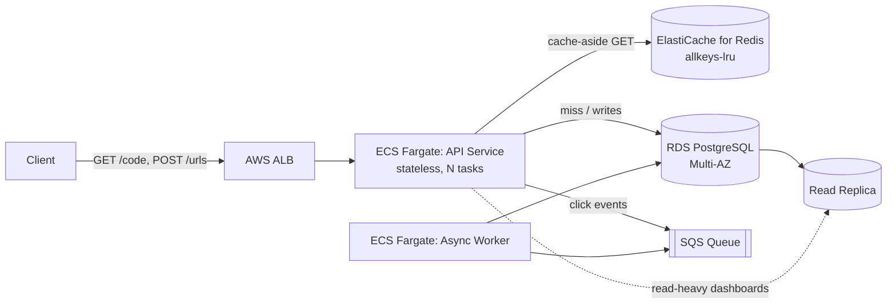

# Module 21: URL Shortener – Backend & Infrastructure (Full Build)

## Requirements

**Functional**
- Shorten a long URL into a short code (6–8 chars), optionally with a user-supplied custom alias.
- Redirect `GET /{code}` to the original long URL with an HTTP 3xx.
- Support optional expiration (`expires_at`); expired links return 410 Gone.
- Track basic analytics (click count) without blocking the redirect path.
- Support link deactivation/deletion by owner.

**Non-functional (assumed for this build)**
- Read:write ratio ~100:1 (redirects dominate creates).
- Redirect p99 latency target: < 10 ms server-side (excluding client network).
- Availability target: 99.95% for redirects (the revenue path), 99.9% for creation.
- Short codes must be unguessable-enough (not sequential in the public-facing string) but generation must be collision-free without a distributed lock.
- System must survive a single AZ failure with no data loss on writes.
- Horizontally scalable API tier; stateless app servers.

## Capacity Estimation

Assume 100M new short URLs created per month and a 100:1 read/write ratio (consistent with the load profiles commonly cited in published URL-shortener designs — see Sources).

- Writes: 100,000,000 / (30 × 86,400) ≈ **~38 writes/sec average**, design for 5–10x burst → ~300–400 writes/sec peak.
- Reads (redirects): 100:1 ratio → **~3,800 reads/sec average**, peak 10x → ~38,000 reads/sec. This is the number that drives the caching and infra decisions below.
- Storage per row: ~500 bytes (long URL up to 2KB truncated/validated, short code 8 bytes, metadata, timestamps, owner id) → budget 600 bytes/row average.
- Storage growth: 100M rows/month × 600 bytes ≈ 60 GB/month → **~720 GB/year** before index overhead; with indexes and replication overhead, budget ~1.5–2 TB/year raw.
- At 5 years retention: ~5–8 TB total, well within a single PostgreSQL instance with partitioning, or a sharded setup if growth exceeds this.

The read-heavy skew is the single most important number in this design: it means the redirect path must almost never touch PostgreSQL under normal load, and everything downstream (caching, DB indexing, deployment topology) is built around that fact.

## ID Generation Strategy

Three candidate approaches, compared:

**1. Auto-increment + Base62 encoding**
Use a PostgreSQL `BIGSERIAL` (or a `SEQUENCE`) as the source of truth, then encode the integer to Base62 (`[0-9a-zA-Z]`, 62 symbols) for the public short code. Base62 is preferred over Base64 because it avoids `+`, `/`, `=` which are unsafe or reserved in URLs.

Encoding scheme:
```
ALPHABET = "0123456789ABCDEFGHIJKLMNOPQRSTUVWXYZabcdefghijklmnopqrstuvwxyz"  # 62 chars

def encode_base62(n: int) -> str:
    if n == 0:
        return ALPHABET[0]
    s = []
    while n > 0:
        n, rem = divmod(n, 62)
        s.append(ALPHABET[rem])
    return "".join(reversed(s))
```
A 6-character Base62 code covers 62^6 ≈ 56.8 billion values — enough for decades at the estimated write rate. 7 characters (62^7 ≈ 3.5 trillion) gives more headroom and is the size chosen for this build.

Pros: simplest to reason about, no collisions possible, codes are short. Cons: a single sequence is a write bottleneck / single point of failure at very high write throughput, and sequential IDs (even encoded) can leak creation order/volume unless the sequence is offset or lightly permuted.

**2. Hash-based (MD5/SHA-256 of the long URL, truncated) + collision check**
Hash the long URL (+ salt/user id to allow the same URL to be shortened differently by different users), take the first 7 base62-safe characters, and on insert check for collision; on collision, append a salt and rehash. Pros: stateless, no central counter, naturally deterministic (same input can dedupe). Cons: requires a uniqueness check-and-retry loop on every write (extra DB round trip), and collision probability rises non-trivially once billions of rows exist in a truncated hash space (birthday paradox), adding tail latency variance to writes.

**3. Snowflake IDs (chosen for this build)**
A Twitter-style Snowflake generator produces a 64-bit integer that is time-sortable, globally unique across distributed generator nodes, and requires no central coordinator or DB round-trip to allocate. The standard bit layout:

```
 0                   1                   1
 1                   0                   0
+-+-------------------------------------------------------+-----------+----------+
|0|          41 bits: timestamp (ms since custom epoch)     | 10 bits   |12 bits   |
| |                                                          | worker id | sequence |
+-+-------------------------------------------------------+-----------+----------+
 63                                                      22          12          0
```
- Bit 63: unused sign bit, always 0 (keeps the value a positive signed 64-bit int).
- Bits 62–22 (41 bits): milliseconds since a custom epoch (e.g. 2024-01-01T00:00:00Z). 41 bits gives ~69 years of range.
- Bits 21–12 (10 bits): machine/worker/datacenter id (often split 5 bits datacenter + 5 bits worker), supporting 1,024 concurrent generator nodes.
- Bits 11–0 (12 bits): per-millisecond sequence counter, allowing 4,096 unique IDs per node per millisecond; the generator increments this and, if it overflows within the same millisecond, busy-waits for the next millisecond tick.

Generation algorithm per node:
```
if current_ms == last_ms:
    sequence = (sequence + 1) & 4095
    if sequence == 0:
        wait_until_next_millisecond()
else:
    sequence = 0
last_ms = current_ms
id = ((current_ms - EPOCH) << 22) | (worker_id << 12) | sequence
```
The resulting 64-bit integer is then Base62-encoded to produce the ~11-character public short code (or truncated/remixed if a shorter code is required — see trade-offs).

**Why Snowflake for this build:** it removes the single-sequence bottleneck of approach 1 while avoiding the collision-retry loop of approach 2, generation is entirely in-process (sub-microsecond, no network hop), and IDs remain k-sortable which is useful for downstream analytics and index locality. The 10-bit worker id is assigned via a small coordination step at process startup (e.g. a Zookeeper/etcd lease, or in a simpler build, a fixed worker id per ECS task derived from task index) — this is the one place true coordination is needed, and only at process start, not per request.

## API Design

**POST /api/v1/urls** — create a short URL
```
Request:
{
  "long_url": "https://example.com/some/very/long/path?query=1",
  "custom_alias": "my-link",       // optional
  "expires_at": "2027-01-01T00:00:00Z"  // optional, ISO 8601
}

Response 201 Created:
{
  "short_code": "3gT9kQ1",
  "short_url": "https://sho.rt/3gT9kQ1",
  "long_url": "https://example.com/some/very/long/path?query=1",
  "expires_at": "2027-01-01T00:00:00Z",
  "created_at": "2026-09-05T10:00:00Z"
}

Errors:
400 Bad Request      - malformed long_url, alias contains invalid chars
409 Conflict          - custom_alias already taken
422 Unprocessable     - long_url fails safety/allowlist validation (e.g. blocked domain)
429 Too Many Requests - per-IP/user rate limit exceeded
```

**GET /{short_code}** — redirect (hot path)
```
Response 301/302 Found
Location: https://example.com/some/very/long/path?query=1

Errors:
404 Not Found  - code never existed
410 Gone       - code existed but expired or was deactivated
```
Use 301 (permanent) only if links are immutable and you want browsers/CDNs to cache aggressively; use 302 if you need every redirect to hit your service for click tracking. This build uses **302** because click analytics is a stated requirement — a cached 301 in the browser bypasses the server entirely on repeat visits.

**GET /api/v1/urls/{short_code}** — metadata/stats lookup (authenticated, not the hot path)
```
Response 200:
{
  "short_code": "3gT9kQ1",
  "long_url": "...",
  "click_count": 4213,
  "created_at": "...",
  "expires_at": "...",
  "active": true
}
```

**DELETE /api/v1/urls/{short_code}** — deactivate (soft delete), 204 No Content, 404 if not found/not owned.

## Database Schema (PostgreSQL)

```sql
CREATE TABLE urls (
    id              BIGINT PRIMARY KEY,          -- Snowflake ID, not auto-increment
    short_code      VARCHAR(16) NOT NULL,
    long_url        TEXT NOT NULL,
    owner_id        BIGINT REFERENCES users(id),
    custom_alias    BOOLEAN NOT NULL DEFAULT FALSE,
    click_count     BIGINT NOT NULL DEFAULT 0,
    is_active       BOOLEAN NOT NULL DEFAULT TRUE,
    expires_at      TIMESTAMPTZ NULL,
    created_at      TIMESTAMPTZ NOT NULL DEFAULT now(),
    updated_at      TIMESTAMPTZ NOT NULL DEFAULT now(),

    CONSTRAINT chk_long_url_length CHECK (char_length(long_url) <= 2048),
    CONSTRAINT uq_short_code UNIQUE (short_code)
);

-- Hot-path lookup: exact-match on short_code, filtered to active rows.
-- Partial index keeps it small — expired/deactivated rows never need to be fast.
CREATE INDEX idx_urls_short_code_active
    ON urls (short_code)
    WHERE is_active = TRUE;

-- Owner dashboard queries ("show me my links"), newest first.
CREATE INDEX idx_urls_owner_created
    ON urls (owner_id, created_at DESC);

-- Efficient cleanup job for expired links.
CREATE INDEX idx_urls_expires_at
    ON urls (expires_at)
    WHERE expires_at IS NOT NULL AND is_active = TRUE;

-- Click events, append-only, decoupled from the hot path (see caching section).
CREATE TABLE click_events (
    id          BIGINT PRIMARY KEY,      -- Snowflake ID
    url_id      BIGINT NOT NULL REFERENCES urls(id),
    clicked_at  TIMESTAMPTZ NOT NULL DEFAULT now(),
    referrer    TEXT,
    country     CHAR(2)
) PARTITION BY RANGE (clicked_at);
```

Design notes:
- `id` is the Snowflake integer (source of truth, sortable, unique); `short_code` is the Base62 string derived from it — stored separately so custom aliases can be swapped in without touching the primary key.
- The **partial index** on `short_code WHERE is_active = TRUE` is the single most important index in the schema: it is the one B-tree the redirect path would ever touch if it bypassed cache, and keeping it partial excludes dead rows, keeping the index small enough to stay resident in shared_buffers.
- `click_events` is partitioned by time (monthly) and written asynchronously (see below) so click tracking never adds latency to the redirect response, and old partitions can be dropped or archived to cheap storage cheaply.
- `long_url` as `TEXT` with a `CHECK` length constraint rather than `VARCHAR(2048)` avoids the fixed-length storage overhead while still bounding abuse.
- Use `BIGINT` throughout (never `INT`) since Snowflake IDs and click volumes both exceed 32-bit range.

## Caching Architecture (Redis)

The redirect path (`GET /{short_code}`) is the path that must never touch PostgreSQL under normal load, given the ~38K peak reads/sec estimated above.

**Pattern: cache-aside (lazy loading).** On a redirect request:
1. `GET short:{code}` from Redis.
2. Cache hit → return long URL immediately, issue the 302, and increment click count asynchronously (see below).
3. Cache miss → read from PostgreSQL via the partial index, write the result into Redis with a TTL, then respond.

Cache-aside (rather than read-through) is chosen because the application already owns the DB access layer and cache-aside keeps Redis's failure mode simple: if Redis is unavailable, requests fall through to Postgres and the service degrades gracefully in latency, not in correctness — no read-through proxy layer to fail as an additional component.

**What's cached:** `short_code → {long_url, is_active, expires_at}` as a small Redis hash or JSON string. Not cached: click counts (see below), owner metadata, anything from the authenticated management API.

**TTL and eviction:**
- TTL: 24 hours per key. Short links follow a strong recency skew (most clicks happen in the days after creation), so a day-long TTL keeps the hot set small while naturally expiring stale/abandoned links out of memory without an explicit invalidation path.
- On explicit deactivation or expiry via the API, the app also does an active `DEL` on the key (write-through invalidation on the mutation path) so a deactivated link doesn't keep serving 302s for up to 24h from cache.
- Eviction policy: `allkeys-lru` with `maxmemory` capped to fit the working set (e.g. 4–8 GB covers tens of millions of hot keys at ~200 bytes each). LRU is appropriate because access is genuinely skewed and recency correlates with future access probability; `volatile-lru` is unnecessary here since effectively every key in this cache carries a TTL.
- Click counts are **not** stored in Redis as the authoritative counter with periodic flush; instead each redirect publishes a lightweight event (`INCR` on a per-code counter key with no TTL relative to the day-partitioned Postgres write, or a Redis Stream / SQS message) that a separate async worker batches into `click_events` and periodically rolls up into `urls.click_count`. This keeps the redirect response independent of any write, satisfying the read-mostly latency target.

## High-Level Architecture & Deployment



**Containerization (Docker, multi-stage build)**
```dockerfile
# ---- build stage ----
FROM golang:1.22-alpine AS build
WORKDIR /src
COPY go.mod go.sum ./
RUN go mod download
COPY . .
RUN CGO_ENABLED=0 go build -o /app/urlshortener ./cmd/api

# ---- runtime stage ----
FROM gcr.io/distroless/static-debian12
COPY --from=build /app/urlshortener /urlshortener
USER nonroot:nonroot
EXPOSE 8080
ENTRYPOINT ["/urlshortener"]
```
The multi-stage build keeps the shipped image to a distroless runtime layer (no shell, no package manager, minimal CVE surface) while the build stage carries the full toolchain. The same pattern applies with a Node/Python/JVM base swapped in for the build stage.

**AWS deployment plan (initial, minimal-viable):**
- **ALB** terminates TLS and routes `/*` to the ECS service target group; health checks on `/healthz`.
- **ECS Fargate** runs the stateless API service (auto-scaled on CPU/request count) and a separate small async-worker service consuming the click-events queue — decoupled scaling from the redirect path.
- **RDS for PostgreSQL, Multi-AZ**, with a read replica for the owner-dashboard/analytics queries so they never compete with hot-path traffic (which shouldn't touch Postgres anyway, but write-heavy backfills and admin queries do).
- **ElastiCache for Redis** (cluster mode disabled initially — single primary + replica is enough at this scale; move to cluster mode only once the working set exceeds a single node's memory).
- **SQS** decouples click-event ingestion from the redirect response.
- **Secrets Manager** for DB/Redis credentials, injected into ECS task definitions.
- **CloudWatch** for metrics/alarms (cache hit ratio, redirect p99, ALB 5xx rate) — cache hit ratio is the single most important dashboard number in this system, since it directly predicts Postgres load.

## Trade-offs and Alternatives Considered

- **Snowflake vs. Base62 auto-increment:** auto-increment is simpler to operate for a single-region, moderate-scale service and was seriously considered; Snowflake was chosen to remove the sequence as a scaling bottleneck and to support future multi-region write paths without re-architecture.
- **302 vs. 301 redirect:** 301 would reduce server load further (browsers cache it) but directly conflicts with the click-analytics requirement; 302 was chosen deliberately, trading some redirect throughput for accurate counts.
- **Cache-aside vs. write-through/read-through:** a read-through layer (e.g. a caching proxy in front of Postgres) was considered but rejected to avoid adding an extra component whose own failure mode would need handling; cache-aside keeps Redis optional from a correctness standpoint.
- **Single Postgres instance vs. sharding:** at the estimated 5–8 TB / 5-year volume, a single well-indexed Postgres instance (with a read replica) is sufficient; sharding by short_code hash was scoped out as premature for this build but noted as the next step if write volume grows an order of magnitude.

## How Real Systems Solve This

Published system-design write-ups for bit.ly/TinyURL-style services converge on the same core shape used here: a stateless API tier, a fast unique-ID scheme decoupled from the database's own auto-increment, and an aggressive cache in front of the redirect path because reads dominate writes by one to two orders of magnitude. Several public breakdowns explicitly walk through Base62 encoding and collision handling for hash-based schemes, and multiple recent write-ups specifically combine Snowflake IDs with Base62 encoding for URL shorteners, which is the approach adopted in this module — see "Designing a Scalable URL Shortener: Snowflake IDs, Base62 Encoding, and Microservices" and the DEV Community walkthrough in Sources. The Snowflake bit-layout itself (41-bit timestamp / worker-id bits / 12-bit sequence) is documented across multiple deep-dives on Twitter's original design, which this module's layout follows directly. Redis's own documentation on the cache-aside pattern and its cache-eviction-strategies guide informed the TTL/eviction choices above.

## Sources

- [Design URL Shortener: System Design Interview Guide](https://www.systemdesign.academy/interview/design-tiny-url-shortener)
- [Design a URL Shortener Like Bit.ly: A Step-by-Step Guide](https://www.systemdesignhandbook.com/guides/design-bitly/)
- [Design TinyURL: System Design Interview Guide for URL Shorteners](https://singhajit.com/tinyurl-system-design/)
- [Designing a Scalable URL Shortener: Snowflake IDs, Base62 Encoding, and Microservices](https://nileshblog.tech/designing-a-scalable-url-shortener-snowflake-ids-base62-encoding-and-microservices/)
- [URL Shortener using Snowflake IDs and Base62 Encoding (DEV Community)](https://dev.to/speaklouder/url-shortener-using-snowflake-ids-and-base62-encoding-4179)
- [How Snowflake IDs Work](https://singhajit.com/snowflake-id-guide/)
- [Designing Unique ID Generators in Distributed Systems: Twitter Snowflake](https://medium.com/@khmousa/designing-unique-id-generators-in-distributed-systems-a-deep-dive-into-twitter-snowflake-with-feb3a03c30fe)
- [Redis: Cache Eviction Strategies Every Redis Developer Should Know](https://redis.io/blog/cache-eviction-strategies/)
- [Redis Docs: Cache-Aside pattern](https://redis.io/docs/latest/develop/use-cases/cache-aside/)
- [Redis Docs: Key Eviction](https://redis.io/docs/latest/develop/reference/eviction/)
