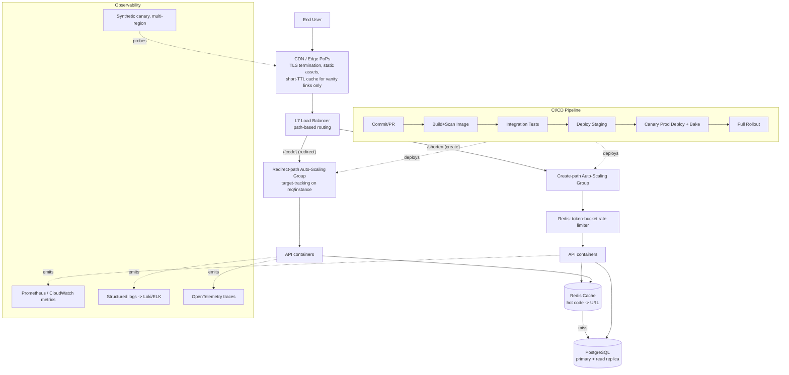

# Module 22: Productionizing the URL Shortener

## Recap of the System Being Productionized

The previous module designed a URL shortener consisting of a stateless API service (handling `POST /shorten` for creation and `GET /{code}` for redirect), a PostgreSQL database as the durable store for the code-to-URL mapping, a Redis layer caching hot codes in front of Postgres to absorb read traffic, and the whole stack packaged as Docker containers for local development and deployment parity. That design got correctness and data modeling right — base62 encoding, collision handling, TTL/expiry semantics — but said nothing about what happens when the service faces real internet traffic: how it scales, survives a viral link, gets deployed safely, and gets observed when something breaks at 3 a.m. This module closes that gap.

## Load Balancing & Traffic Distribution

The redirect path (`GET /{code}`) is the dominant workload by orders of magnitude versus the create path — typical read:write ratios for link shorteners run 100:1 to 1000:1 — and it is latency-sensitive because a redirect sits inline in a user's click, before the destination page even starts loading. This shapes the load-balancing design:

- **Layer 7 (HTTP) load balancer in front of the API tier.** An ALB (AWS) or equivalent (NGINX, Envoy, HAProxy, GCP HTTP(S) LB) terminates TLS, health-checks instances/pods, and distributes requests. L7 is preferred over a plain L4/TCP balancer here because it can route on path (`/{code}` vs `/api/*`), attach different target groups/timeouts per route class, and return fast synthetic responses (e.g., 429s) without hitting a backend.
- **Least-outstanding-requests or least-connections algorithm**, not round-robin, for the redirect target group. Redirect handlers have highly variable per-request cost (cache hit vs Postgres fallback), so round-robin can pile requests onto an instance that's mid-stall on a DB call; least-connections self-corrects.
- **Separate target groups / connection pools for create vs redirect**, even though it's the same container image. This means a burst of write traffic (e.g., a bulk-import client) cannot starve connection slots needed for redirects, and it lets each group scale and get health-checked independently.
- **Keep-alive and connection reuse** between the LB and backend instances (HTTP/1.1 keep-alive or HTTP/2) to avoid TCP/TLS handshake overhead per redirect — meaningful at this request volume and latency budget.
- **Multi-AZ target registration** so the LB spreads instances across at least two, ideally three, availability zones, with cross-zone load balancing enabled — a single-AZ outage should not take the redirect path down.

The `GET /{code}` handler itself should resolve almost entirely from Redis; the LB's job is to make sure that fast path isn't the thing waiting in a queue behind slow work.

## Auto-Scaling Architecture

The redirect service is scaled independently from any batch/admin components, using an auto-scaling group (EC2 ASG) or ECS/Kubernetes HPA equivalent, driven by **target tracking** rather than manual step scaling as the primary policy:

- **Primary metric: `ALBRequestCountPerTarget` (requests/instance) or CPU utilization**, target-tracked to a value that keeps p99 latency in budget with headroom — for example, target 1,000 req/min/instance or 60% CPU. Target tracking is preferred over step scaling because a redirect service's load is highly variable and largely un-predictable (a link can go viral in minutes) — target tracking auto-computes the needed capacity change rather than requiring pre-defined step thresholds, and AWS's own guidance recommends it as the default for this exact "unpredictable, bursty" traffic shape ([Step Scaling vs Simple Scaling vs Target Tracking](https://tutorialsdojo.com/step-scaling-vs-simple-scaling-policies-in-amazon-ec2/), [AWS: Introducing Target Tracking Scaling Policies](https://aws.amazon.com/about-aws/whats-new/2017/07/introducing-target-tracking-scaling-policies-for-auto-scaling)).
- **A supplementary step-scaling (or scheduled) policy for known events** — e.g., a marketing team announcing a campaign link — that pre-warms capacity ahead of the target-tracking loop reacting, because target tracking still has a control-loop lag (typically 1-3 minutes of sustained breach before it acts).
- **Fast scale-out, slow scale-in.** Configure a short scale-out cooldown (e.g., 60s) so the group reacts quickly to a spike, but a longer scale-in cooldown (e.g., 5 minutes) to avoid flapping when traffic is merely bursty rather than sustained.
- **Cache-aware capacity floor:** because Redis absorbs most reads, CPU/instance-count scaling should be paired with a **Redis-side alarm on cache hit ratio and eviction rate** — if hit ratio drops (e.g., a viral link's neighborhood of codes evicts other hot entries), API instances start taking the Postgres-read path far more often, and *that* is what actually saturates CPU, so the API metric alone is a reasonably good proxy but Redis health should also gate a scale note in the alert, not just the ASG.

**Worked example — a link goes viral:**

1. Steady state: 4 instances, ~300 req/min/instance, CPU ~35%, cache hit ratio 98%.
2. A shared link starts trending; traffic to `GET /{code}` climbs to 15,000 req/min within 3 minutes.
3. `ALBRequestCountPerTarget` target tracking policy (target: 1,000 req/min/instance) detects the ratio breach after ~1 evaluation period (60s) and computes required capacity: 15,000/1,000 = 15 instances.
4. ASG scales from 4 → 15 over roughly 1-2 scaling steps (bounded by a configured max, e.g., 25, and a scale-out cooldown of 60s to allow re-evaluation).
5. New instances register with the ALB, pass health checks (a `/healthz` that checks Redis + DB connectivity, not just process liveness), and begin taking traffic within ~90 seconds of instance boot (favoring small, fast-booting containers over heavyweight VMs for this reason).
6. Redis absorbs the read spike for the single hot code (single-key hot-read — see CDN section below for why this is also where a CDN matters); Postgres load stays flat because the row is cached.
7. Traffic recedes after 30 minutes; the scale-in cooldown (5 min) and a lower CPU/request-count threshold bring the group back down to 4-6 instances over ~15-20 minutes, avoiding thrashing.

## CDN Integration

A CDN (CloudFront, Fastly, Cloudflare) sitting in front of the redirect endpoint is worth doing, but only with a precise understanding of redirect caching semantics — this is the part of the design most often gotten wrong.

**301 vs 302 and cache behavior:**

- **301 (Moved Permanently)** is treated by browsers and by CDNs/intermediate caches as **cacheable by default**, even with no explicit `Cache-Control` header, per long-standing HTTP semantics ([RFC 9110 / prior 3xx caching discussion](https://www.oreilly.com/library/view/web-caching/156592536X/apfs03.html)). A browser that receives a 301 for `short.ly/abc123` may skip the network entirely on the next click and jump straight to the target URL from its own local cache — the shortener's server (and any CDN) never sees that follow-up request. CloudFront specifically will cache a 301/302 response from the origin **only if it carries `Cache-Control`/`Expires` headers or a cache policy directs it to**, and by default has a short list of status codes it caches at all — see [How CloudFront processes HTTP 3xx status codes from your origin](https://docs.aws.amazon.com/AmazonCloudFront/latest/DeveloperGuide/http-3xx-status-codes.html) for the exact defaults and how to override via a cache policy's "customize error/redirect caching" settings.
- **302 (Found) / 307 (Temporary Redirect)** are semantically "don't cache this, it may change" and browsers largely honor that by re-requesting each time unless explicit caching headers say otherwise.
- **Implication for this service: use 302 (or explicit `Cache-Control: no-store` on a 301) for the public redirect**, not a bare 301, *specifically because* the target URL of a short code is mutable (users can edit/delete links, links expire, A/B or geo-based redirect targets can change) and a client- or CDN-cached 301 is effectively impossible to invalidate — you cannot purge a browser's local HTTP cache on millions of end-user devices. This is the single most important "gotcha" in this design: the intuitive choice (301, "it's permanent, right?") is the one that breaks the product the moment a link's destination needs to change.
- **What the CDN should still do:** even without caching the 301/302 response bytes themselves, terminate TLS and connections at edge PoPs close to the user, which cuts connection-setup latency substantially for a globally distributed audience — this is real latency benefit independent of caching the redirect body. Additionally, put a **short, explicit TTL** (e.g., `Cache-Control: public, max-age=30`) on redirects for codes that are provably immutable/permanent (e.g., a "vanity" link a paying customer has committed to, with an explicit "this cannot change" product guarantee) — that is the one case where CDN-edge caching of the 3xx is safe and valuable, because a viral spike on that one code is then served entirely from edge PoPs with zero origin hits.
- **Cache invalidation on target change:** for any code whose response was cached (short-TTL immutable links), a target-URL update must trigger an explicit CDN invalidation/purge of that path (CloudFront `CreateInvalidation`, or a cache-tag-based purge on Fastly/Cloudflare) as part of the update transaction — do this synchronously in the update API handler so there is no window where the CDN serves a stale destination past the TTL policy's guarantee.
- **Static assets (dashboard UI, docs) are a separate, uncontroversial CDN caching case** — cache those aggressively with normal `Cache-Control`, no such nuance applies.

## Monitoring & Observability

Tooling: Prometheus + Grafana (self-hosted/EKS) or CloudWatch + Managed Grafana if AWS-native; distributed tracing via OpenTelemetry → Jaeger/Tempo; structured logs shipped to Loki/CloudWatch Logs/ELK. For a redirect-shaped service, alert on:

| Signal | Why it matters | Example threshold |
|---|---|---|
| Redirect p50/p99 latency | Sits inline in user click path; p99 catches tail stalls hidden by averages | Page if p99 > 150ms for 5 min |
| Redirect error rate (5xx) | Direct user-facing breakage | Page if > 1% over 5 min |
| 404 rate on `/{code}` | Spike suggests bot enumeration/scraping of code space, or a bad deploy/cache-miss bug | Warn if > baseline x3 |
| Redis cache hit ratio | Falling hit ratio predicts DB load surge before it happens — a leading indicator | Warn if < 90% sustained |
| Postgres read replica lag / connection pool saturation | Cache-miss fallback path; saturation here cascades into redirect latency | Warn at 80% pool utilization |
| Create-endpoint request rate & 429 rate | Detects abuse and confirms rate limiter is engaging without over-blocking legitimate use | Warn if 429 rate > 5% |
| ASG/HPA scaling events + "at max capacity" | Confirms auto-scaling is keeping pace with traffic, flags when a spike outran configured max | Page if at max for > 10 min |
| CDN cache hit ratio + edge error rate (for cached vanity links) | Confirms CDN offload is working; edge errors indicate misconfigured cache policy | Warn if edge 5xx > baseline |

A synthetic canary (an external health-check hitting a known-good short code every minute from multiple regions) is worth running independently of internal metrics, since it's the only signal that reflects what an actual end user experiences, LB and CDN included.

## CI/CD Pipeline

Concrete pipeline for this containerized service (GitHub Actions / GitLab CI, deploying to ECS or Kubernetes):

1. **Commit / PR trigger** — lint, type-check, unit tests (encoding logic, collision handling) run in parallel matrix jobs.
2. **Build** — build the Docker image, tag with the Git SHA (immutable tags, never `latest` in production manifests).
3. **Integration tests** — spin up the image plus ephemeral Postgres + Redis containers (via `docker compose` or Testcontainers) in the CI runner; run API-level tests against real dependencies, not mocks, for the redirect and create paths.
4. **Security/quality gates** — image vulnerability scan (Trivy/Grype), dependency audit, SAST; block merge on high/critical findings.
5. **Push to registry** — push the tagged image to ECR/GCR/Docker Hub on merge to main.
6. **Deploy to staging** — automatic deploy to a staging ECS service/K8s namespace; run smoke tests against the real create→redirect flow.
7. **Canary/blue-green production deploy** — shift a small percentage of production traffic (e.g., 5%) to the new task set/revision via ECS CodeDeploy blue-green or a K8s canary rollout; auto-monitor the error-rate and p99-latency alarms from the Monitoring section for a bake period (e.g., 10 minutes); auto-rollback on alarm breach.
8. **Full rollout** — on a clean bake, shift 100% of traffic; keep the previous task set/revision warm for a fast manual rollback window (e.g., 30 minutes) before it's torn down.
9. **Database migrations** run as a separate, explicit pipeline step *before* the new image deploys, using expand/contract (additive, backward-compatible) migrations so the old and new API versions can both run against the same schema during the rollout window.

## Rate Limiting & Abuse Prevention

The create endpoint (`POST /shorten`) is the abuse surface — unbounded, it lets a single client mint unlimited short codes (spam-link farms, phishing redirection, code-space exhaustion). Design:

- **Algorithm: token bucket**, keyed per API key / per authenticated user where available, falling back to per-IP for anonymous use. Token bucket is preferred here over a fixed window because it smooths bursts without the fixed-window edge-of-window double-burst problem, while still being cheap to implement in Redis with a single `INCR`+TTL or a Lua script for atomicity ([token bucket vs sliding window comparison](https://blog.arcjet.com/rate-limiting-algorithms-token-bucket-vs-sliding-window-vs-fixed-window/), [Arcjet rate limiting guide](https://arcjet.com/learn/rate-limiting-guide)). A sliding-window-counter variant is a reasonable alternative if stricter burst control is needed, at the cost of slightly more Redis work per request.
- **Limits tiered by trust level**: anonymous/unauthenticated IPs get a low bucket (e.g., 10 creates/min, burst 20); authenticated free-tier users get a higher bucket; paid/API-key tiers get the highest, with limits enforced and configured per key rather than globally.
- **Enforce at the edge where possible** — a WAF rule or API Gateway usage plan catches obvious abuse (single IP hammering the endpoint) before it reaches the API tier at all, reserving the application-level token bucket for nuanced, per-account limits.
- **429 response with `Retry-After` header**, and the create endpoint should return this fast (no DB round-trip) — reject-on-limit is a Redis-only check.
- **Abuse beyond rate**: validate and reject destination URLs against a blocklist/reputation check (known phishing/malware domains) synchronously at creation time, and consider CAPTCHA or email verification for anonymous creation if abuse volume warrants it.
- **Logging**: structured JSON logs for every create (source IP, API key/user id, target domain, result) retained separately from redirect logs (higher volume, shorter retention, sampled) — this asymmetry matters operationally: redirect logs are sampled/aggregated for volume reasons, create logs are kept in full for abuse investigation and audit.

## Production Readiness Checklist

- [ ] Redirect and create paths served by separate LB target groups / autoscaling groups
- [ ] Health checks validate DB + Redis connectivity, not just process liveness
- [ ] Auto-scaling target-tracking policy tuned and load-tested against a simulated viral spike
- [ ] Redis configured with eviction policy (`allkeys-lru` or similar) and hit-ratio alarm
- [ ] Postgres has a read replica (or is fully behind cache) and connection pooling (PgBouncer) configured
- [ ] Redirect responses use 302 (or short-TTL 301 only for explicitly immutable vanity links)
- [ ] CDN cache policy explicitly reviewed for 3xx handling; invalidation wired into the update-link code path
- [ ] TLS everywhere (LB, CDN, service-to-DB); secrets in a secrets manager, not env files in the image
- [ ] Rate limiting live on the create endpoint with tiered limits and 429/Retry-After
- [ ] Structured logging with correlation/request IDs across LB → API → DB
- [ ] Dashboards + alerts for p99 latency, 5xx rate, 404 rate, cache hit ratio, create 429 rate
- [ ] Synthetic canary monitoring redirect end-to-end from multiple regions
- [ ] CI/CD pipeline with automated tests, vulnerability scanning, canary deploy, and auto-rollback on alarm breach
- [ ] Database migrations use expand/contract pattern; runbook exists for manual rollback
- [ ] Multi-AZ deployment for API, LB, and database tier; documented RTO/RPO
- [ ] Load test performed at 10x expected peak before go-live, with results tied back to the auto-scaling max-capacity setting

## Updated Architecture Diagram

## Trade-offs and Alternatives Considered

- **CDN-cached redirects vs always-dynamic**: caching more aggressively at the edge would cut origin load further but reintroduces the invalidation problem described above; the chosen design trades some CDN offload for correctness on mutable links, treating edge-caching as an opt-in feature for a specific link class rather than a default.
- **Target tracking vs step scaling as primary policy**: step scaling gives more precise control over exact capacity at each threshold, but requires anticipating traffic shapes in advance; target tracking was chosen as primary specifically because viral-traffic shocks are, by definition, not anticipated — step scaling is kept only as a secondary, scheduled tool for known events.
- **Token bucket vs sliding-window-log for rate limiting**: a sliding window log gives perfectly precise rate enforcement but costs more memory/CPU per request (storing timestamps); token bucket was chosen for its O(1) Redis cost at the scale of a public create endpoint, accepting slightly looser burst semantics.
- **Read replica vs cache-only reliance**: relying purely on Redis for reads is cheaper but makes a full cache-eviction event (cold cache after a Redis failover) a thundering-herd risk against a single Postgres primary; a read replica is kept as a fallback tier specifically to absorb that scenario, at the cost of replica lag and added operational surface.

## How Real Systems Solve This

Real-world short-link platforms (Bitly-class systems) and CDN vendors describe the same core patterns surfaced above from the origin side: CloudFront's own documentation is explicit that 3xx responses are cached only under specific default rules and that origins wanting different behavior must set explicit cache-control or a custom cache policy for redirect responses ([How CloudFront processes HTTP 3xx status codes](https://docs.aws.amazon.com/AmazonCloudFront/latest/DeveloperGuide/http-3xx-status-codes.html), [tecRacer: Mastering URL Redirections with AWS CloudFront Functions](https://www.tecracer.com/blog/2024/08/mastering-url-redirections-with-aws-cloudfront-functions.html)) — teams that get bitten by "my updated link still points at the old destination for some users" have almost always shipped a bare 301 with no cache-control and no purge path, exactly the failure mode this module designs around. On the scaling side, AWS's guidance and community write-ups consistently recommend target tracking as the default policy for services with unpredictable, spiky load and reserve step/scheduled scaling for known, anticipated events ([Step Scaling vs Simple Scaling vs Target Tracking, TutorialsDojo](https://tutorialsdojo.com/step-scaling-vs-simple-scaling-policies-in-amazon-ec2/)) — which matches exactly the "viral link" traffic shape a redirect service must survive. On rate limiting, the current industry consensus (Arcjet, API7, and others) treats token bucket as the practical default for public write/create endpoints because of its low per-request cost and natural burst tolerance, reserving sliding-window variants for cases needing stricter precision ([Arcjet rate limiting guide](https://arcjet.com/learn/rate-limiting-guide), [API7: rate limiting guide](https://api7.ai/blog/rate-limiting-guide-algorithms-best-practices)).

## Sources

- [How CloudFront processes HTTP 3xx status codes from your origin](https://docs.aws.amazon.com/AmazonCloudFront/latest/DeveloperGuide/http-3xx-status-codes.html)
- [Mastering URL Redirections with AWS CloudFront Functions | tecRacer Blog](https://www.tecracer.com/blog/2024/08/mastering-url-redirections-with-aws-cloudfront-functions.html)
- [3xx Redirects — Web Caching (O'Reilly)](https://www.oreilly.com/library/view/web-caching/156592536X/apfs03.html)
- [How to configure HTTP redirects in CloudFront | AWS re:Post](https://repost.aws/articles/ARhXqRGZr_TaiFfIptHK5-GA/how-to-configure-http-redirects-in-cloudfront)
- [Step Scaling vs Simple Scaling Policies vs Target Tracking Policies in Amazon EC2 | TutorialsDojo](https://tutorialsdojo.com/step-scaling-vs-simple-scaling-policies-in-amazon-ec2/)
- [Introducing Target Tracking Scaling Policies for Auto Scaling | AWS](https://aws.amazon.com/about-aws/whats-new/2017/07/introducing-target-tracking-scaling-policies-for-auto-scaling)
- [ECS Fargate Autoscaling: Target Tracking & Step Scaling](https://fortem.dev/blog/ecs-fargate-autoscaling/)
- [Token Bucket vs. Sliding Window: The Rate Limiting Choice That Shapes Your API's Behavior](https://medium.com/@tihomir.manushev/token-bucket-vs-sliding-window-the-rate-limiting-choice-that-shapes-your-apis-behavior-e04fb2646ee5)
- [Rate-limiting algorithms compared: token bucket, leaky bucket, sliding window, and fixed window | Arcjet](https://blog.arcjet.com/rate-limiting-algorithms-token-bucket-vs-sliding-window-vs-fixed-window/)
- [Rate Limiting Algorithms: Token Bucket vs Sliding Window | Arcjet Learn](https://arcjet.com/learn/rate-limiting-guide)
- [From Token Bucket to Sliding Window: Pick the Perfect Rate Limiting Algorithm | API7.ai](https://api7.ai/blog/rate-limiting-guide-algorithms-best-practices)
