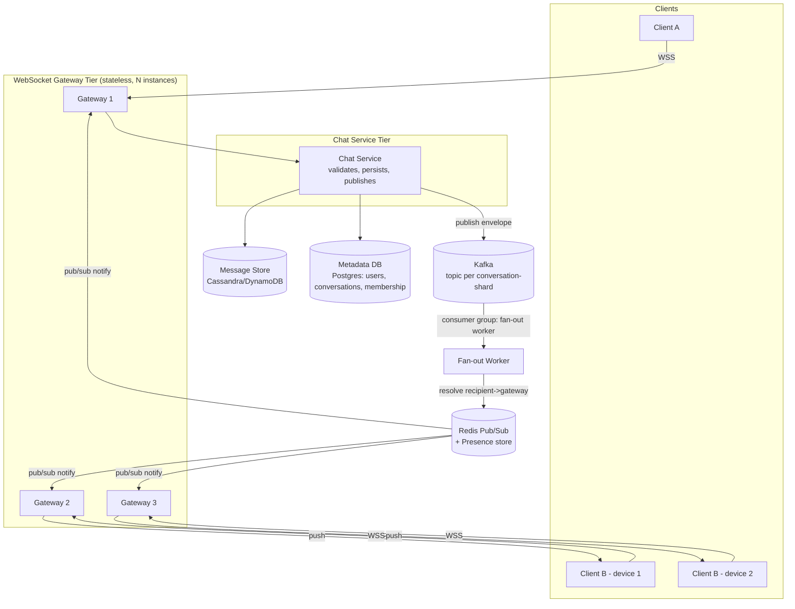

# Module 23: Real-Time Chat System (Full Build)

## Requirements

**Functional**
- 1:1 direct messages and group chats (channels) with up to ~10,000 members per channel.
- Message history persisted and paginable (infinite scroll backward from "now").
- Delivery receipts (server received, delivered to device) and read receipts (per-user, per-message or per-conversation "last read" watermark).
- Presence: online / offline / "typing…" indicators, visible to conversation participants.
- Reconnect resilience: a client that drops and reconnects (network flap, phone sleep) must not lose messages sent while it was away.
- Multi-device: a user may have the app open on phone + laptop simultaneously; both must receive every message.

**Non-functional (explicitly assumed)**
- Scale: 50M daily active users, 5M peak concurrent WebSocket connections.
- Latency: p99 end-to-end message delivery (sender send → recipient receive, both online) under 250 ms within a region.
- Availability: 99.95%, and a single gateway/broker instance failure must not drop active connections beyond that instance's own clients (who reconnect).
- Durability: a message acknowledged to the sender must survive a broker/service crash (no silent message loss).
- Ordering: messages within a single conversation are delivered in a consistent order to all recipients (strict global ordering across conversations is not required).
- Horizontal scalability: WebSocket gateway tier and chat service must scale out by adding stateless instances; no component should require sticky global state beyond a documented shared store.

## Capacity Estimation

Assume 50M DAU, 5M concurrent connections at peak, average user sends 40 messages/day.

- **Messages/day** = 50M × 40 = 2B messages/day → **~23,000 msgs/sec average**, with a typical 5-8x diurnal peak factor → **~150,000 msgs/sec at peak**.
- **Fan-out multiplier**: average conversation has ~6 members (mix of 1:1 and small/large groups); large channels (1,000+ members) are a minority but dominate fan-out volume. Assume a blended fan-out factor of 8x → **~1.2M message-deliveries/sec at peak** that must be pushed out over WebSockets.
- **Connections per gateway instance**: a tuned event-loop server (Node.js with `ws`, or Elixir/Cowboy, or Go) comfortably holds 40,000-80,000 concurrent idle WebSocket connections per instance (bounded by memory ~20-40 KB/connection and file descriptors). At 5M concurrent connections and 50k/instance → **~100 gateway instances**.
- **Storage**: average message ~150 bytes (text + metadata). 2B msgs/day × 150 B ≈ 300 GB/day of raw message data, ~110 TB/year before compression/replication — this is squarely a wide-column / LSM-tree store problem (Cassandra/ScyllaDB/DynamoDB), not a single relational instance.
- **Presence updates**: heartbeat every 20-30s per connection → 5M connections / 25s ≈ **200,000 presence writes/sec** just from heartbeats — this must land on an in-memory store (Redis), not the primary database.

## High-Level Architecture



**Tiers:**
1. **WebSocket Gateway** — stateless, terminates TLS/WSS, authenticates the connection (JWT on connect), holds the live socket. Knows nothing about conversation membership; just maps `connection_id ↔ user_id` and forwards frames.
2. **Chat Service** — stateless HTTP/gRPC service. Validates a send request, writes the message to durable storage, then publishes it to Kafka. This is the synchronous, ack-bearing path — the client's "sent" checkmark depends on this step succeeding.
3. **Kafka** — durable, ordered, replayable log used for asynchronous fan-out, especially for large groups. Partitioned by `conversation_id` so all messages in one conversation are strictly ordered.
4. **Fan-out workers** — consume Kafka, expand a conversation into its member list (from the metadata DB, cached), and for each online member, look up which gateway instance holds their connection.
5. **Redis** — two jobs: (a) **Pub/Sub** channels (one per gateway instance, or per user) used to cross the gateway-instance boundary in real time; (b) a **presence store** (hash/TTL keys) recording `user_id → {status, last_heartbeat, gateway_instance_id}`.
6. **Message store** — Cassandra/ScyllaDB/DynamoDB, partitioned by `conversation_id`, clustered by `message_id`/timestamp, built for high-write-throughput append and range-scan reads.
7. **Metadata store** — Postgres/MySQL for users, conversation membership, and settings — lower volume, needs relational integrity.

## Connection & Presence Management

Gateways are stateless *between requests* but each one **does** hold live socket state in memory for its currently-attached connections — that part can't be externalized without breaking real-time delivery. The problem this section solves is: *how does the rest of the system know which of the N gateway instances holds a given user's socket, and how is "online/offline/typing" kept consistent when that mapping changes constantly (reconnects, deploys, crashes)?*

**Mechanism:**
- On connect, the gateway registers the user in Redis: `HSET presence:{user_id} status=online gateway=gw-07 last_seen=<ts>` with a **TTL-refreshing heartbeat** (client pings every ~20s over the same WebSocket; gateway refreshes the TTL, e.g. `EXPIRE presence:{user_id} 45`).
- If the client goes silent for longer than the TTL (network drop, app killed, gateway crash) the key **expires automatically** — Redis key-space notifications or a periodic sweep publish an `offline` event without requiring an explicit disconnect handshake. This is the crucial trick: presence correctness does not depend on a graceful close, which real networks rarely give you.
- On graceful disconnect, the gateway proactively deletes the key and publishes `offline` immediately (faster than waiting for TTL expiry).
- Multi-device: presence key is actually `presence:{user_id}:{device_id}` (or a set of device entries under one hash); the user is "online" if **any** device entry is live. This also lets fan-out target the specific device/gateway pairs rather than assuming one connection per user.
- **Typing indicators** are intentionally *not* durable and *not* run through Kafka — they're ephemeral, high-frequency, and lossy-tolerant, so they go straight over Redis Pub/Sub from the sending gateway to the other participants' gateways, with a short client-side auto-expiry (e.g., "stopped typing" after 5s of silence) so a dropped "stop typing" event self-heals.
- Because presence lives in Redis (not gateway memory, not the primary DB), any service (chat service deciding whether to send a push notification for an offline user, another gateway needing to route a message) can query "is this user online, and if so, which gateway" without talking to the gateway tier directly.

This is the same shape used in practice: Slack's Gateway Servers proxy presence queries to dedicated Presence Servers rather than tracking it locally, and the fan-out for a channel goes through servers that know the full subscriber list, not through the gateways themselves.

## Message Flow Deep Dive

Trace a message sent by User A (connected to Gateway 1) in a 500-member group, where recipient User B is connected to Gateway 3:

1. **Client → Gateway**: A's client sends a WebSocket frame: `{type: "send", conversation_id, client_msg_id, body}`. `client_msg_id` is a client-generated idempotency key (UUID) used to dedupe retries after a reconnect.
2. **Gateway → Chat Service**: Gateway 1 forwards the frame over an internal gRPC call to the Chat Service (gateways do not talk to Kafka or the DB directly — keeps them thin and stateless).
3. **Persistence (synchronous)**: Chat Service assigns a server-side `message_id` (time-sortable, e.g. Snowflake/ULID), writes the message row to the message store keyed by `(conversation_id, message_id)`, and only *then* returns an ack to Gateway 1, which flips the client's UI to "sent". This ordering matters: never ack before durable write, or a crash between ack and write silently loses a message the sender believes was delivered.
4. **Kafka publish (asynchronous)**: Chat Service publishes the same message envelope to a Kafka topic partitioned by `conversation_id`. This step is decoupled from the client ack — the sender doesn't wait for fan-out to complete.
5. **Fan-out worker**: A consumer group reads the partition, loads (from a cache-backed membership table) the list of the conversation's 500 members, and for each one checks Redis presence. Offline members get routed to a push-notification service (APNs/FCM) instead; online members get routed onward.
6. **Redis Pub/Sub — the cross-instance hop**: For each online member, the worker publishes to a Redis channel keyed by that member's gateway instance (e.g. `gw-channel:gw-03`) — not a channel per conversation, to avoid every gateway receiving traffic for conversations it has no connections for. Gateway 3, subscribed to its own channel, receives the message and looks up its local in-memory connection table to find B's live socket.
7. **Gateway → Client**: Gateway 3 pushes the frame down B's WebSocket. B's client renders the message and, once rendered, sends a `read` receipt back through the same path in reverse, updating a per-user "last read message_id" watermark (not a row per message — see Data Model).

**Why both Kafka and Redis Pub/Sub — not just one:**
- **Kafka is durable and replayable; Redis Pub/Sub is not.** A message published to a Redis channel with no active subscriber is gone forever (fire-and-forget, no queue). If we fanned out large groups directly over Redis Pub/Sub, any fan-out worker crash mid-broadcast would silently drop messages for whichever members hadn't been processed yet, with no way to recover. Kafka gives us an at-least-once, replayable log — if a fan-out worker crashes, another consumer in the group resumes from the last committed offset and nobody is skipped.
- **Kafka decouples fan-out throughput from delivery latency.** A 500-member (or 100k-member) broadcast is naturally a batch/expansion workload; running it synchronously on the hot request path would blow the p99 send latency. Kafka lets fan-out happen asynchronously and be scaled independently (more consumer instances) without touching the synchronous "did my message get saved" path.
- **Redis Pub/Sub is the only piece that solves the "which process holds this socket" problem in real time.** Kafka has no concept of "instance gw-03 currently holds a live TCP connection for user B" — that's inherently ephemeral, in-memory state, and Redis Pub/Sub (or an equivalent like NATS) is the low-latency, low-overhead mechanism to hop from a stateless worker to the one specific stateful gateway process holding that socket, in single-digit milliseconds.
- In short: **Kafka answers "did this fan-out work reliably and can we replay it," Redis Pub/Sub answers "how do I reach the exact process holding this one live connection, right now."** They solve different problems in the same pipeline and neither substitutes for the other. This mirrors Slack's split between Channel Servers (durable-ish, ordered broadcast to subscribed Gateway Servers) and the Gateway Servers' own proxying of live client state.

## Data Model

```
users(user_id PK, username, display_name, created_at, ...)

conversations(conversation_id PK, type ENUM(dm, group), created_at, last_message_id)

conversation_members(conversation_id, user_id, joined_at, role, last_read_message_id, muted)
  PK (conversation_id, user_id)   -- also indexed by user_id for "my conversations" list

messages(conversation_id, message_id, sender_id, body, sent_at, edited_at, deleted BOOL)
  PARTITION KEY: conversation_id
  CLUSTERING KEY: message_id DESC   -- message_id is time-sortable (Snowflake/ULID)

read_receipts(conversation_id, user_id, last_read_message_id, read_at)
  -- watermark model, NOT one row per (message, reader) — O(members) not O(messages x members)

presence(user_id, device_id) -> {status, gateway_instance, last_heartbeat}  -- Redis, TTL-based, not in the durable DB
```

**Why a watermark for read receipts, not per-message rows**: in a 500-member channel, per-message-per-reader rows would be 500x write amplification on every message. Storing just `last_read_message_id` per `(conversation, user)` and comparing against `message_id` ordering gives "read up to here" semantics in O(1) writes per read event, and read-count/read-by-whom UI can be computed on demand by comparing watermarks, only for conversations small enough that this is a cheap UI to render (Slack and WhatsApp both cap "seen by" lists rather than compute them for huge groups).

**Pagination**: history is fetched with a **cursor on `message_id`** (which is itself time-sortable), not `OFFSET/LIMIT`. A request looks like `GET /conversations/{id}/messages?before={message_id}&limit=50`. Because the store's clustering key is `message_id DESC` within the `conversation_id` partition, this is a single efficient range scan — no full-table scan, no offset drift when new messages arrive concurrently (the classic bug with offset-based pagination on a live-appending table).

## API / Protocol Design

**WebSocket envelope** (JSON over WSS; binary/protobuf is a valid alternative at higher scale to cut payload size and parse cost):

```json
{
  "type": "message.send",
  "client_msg_id": "c-9f21...",
  "conversation_id": "conv_882",
  "body": { "text": "hey, you there?" },
  "sent_at_client": 1725500000123
}
```

Server → client push:
```json
{
  "type": "message.new",
  "message_id": "01HZY...ULID",
  "conversation_id": "conv_882",
  "sender_id": "u_42",
  "body": { "text": "hey, you there?" },
  "sent_at": 1725500000456
}
```

Other envelope `type`s: `message.ack`, `message.read`, `presence.update`, `typing.start`/`typing.stop`, `error`. A single envelope shape (discriminated by `type`) keeps the gateway's parsing/routing logic uniform.

**REST endpoints** (for anything that isn't inherently push — history, cold start, search):
- `GET /conversations/{id}/messages?before={message_id}&limit=50` — paginated history.
- `GET /conversations?cursor=...` — the user's conversation list, ordered by last activity.
- `POST /conversations/{id}/read` — set the read watermark (also settable over the WS envelope; REST exists for non-connected clients, e.g. a push-notification tap that opens a fresh app instance before the socket is up).
- `GET /users/{id}/presence` — one-shot presence check (backed by the same Redis store), for clients that want a snapshot without subscribing.

## Trade-offs and Alternatives Considered

- **Redis Pub/Sub vs. a durable message broker for the delivery hop**: Redis Pub/Sub was chosen for the gateway-to-gateway hop specifically because it's low-latency and we don't need durability there — Kafka already guarantees the message itself isn't lost; Pub/Sub only needs to reliably reach a socket that we already know (via presence) is live *right now*. The trade-off: if Redis itself has a brief outage, in-flight real-time pushes are lost for connected users, though the underlying message is safe in Kafka/the DB and will be picked up on next fetch/reconnect. An alternative is Redis Streams (durable, consumer-group semantics) for this hop, at the cost of higher latency and operational complexity — not worth it here since Kafka already provides durability upstream.
- **Cassandra/DynamoDB vs. Postgres for message storage**: a relational store struggles at this write volume and partition pattern (single hot table growing unboundedly); a wide-column store partitioned by `conversation_id` matches the access pattern (append + range-scan by conversation) exactly. Trade-off: no cheap ad-hoc joins/search — full-text search needs a separate index (Elasticsearch) fed by CDC off the message store.
- **WebSockets vs. long polling / SSE**: WebSockets chosen for full-duplex, low-overhead bidirectional traffic (typing indicators, acks) that SSE/long-polling handle awkwardly (SSE is server→client only; long polling has higher latency and connection churn). Trade-off: WebSockets need connection-aware infrastructure (load balancers with sticky-enough routing at connect time, careful reconnect/backoff logic on the client) that plain HTTP doesn't.
- **Kafka partitioned by conversation_id vs. by shard-hash**: partitioning by `conversation_id` guarantees per-conversation ordering for free but risks hot partitions for very large channels (a viral 100k-member channel could saturate one partition/consumer). Mitigation: for channels above a member threshold, sub-shard fan-out across a pool of workers reading the same partition's *output* (ordering preserved on write, fan-out is what's parallelized).
- **Skipping Kafka entirely and fanning out straight from Chat Service via Redis Pub/Sub**: simpler, lower latency for small groups, but reintroduces the durability gap described above for large groups and removes the ability to replay fan-out after a consumer crash — rejected for anything beyond small DMs.

## How Real Systems Solve This

- **Slack** uses regional **Gateway Servers** that hold client WebSockets and subscribe (via consistent hashing) to the **Channel Servers** responsible for the channels their users are in; a send is routed through Channel Servers, which broadcast to every subscribed Gateway Server worldwide, each of which fans out to its local sockets — end-to-end delivery in roughly 500ms globally. Presence is deliberately handled by dedicated **Presence Servers**, with Gateway Servers acting only as a proxy for presence queries rather than owning that state themselves — directly analogous to this module's Redis presence store. ([Slack Engineering: Real-time Messaging](https://slack.engineering/real-time-messaging/))
- **Discord** runs its gateway tier on Elixir/Erlang (using Cowboy for the WebSocket layer and GenStage for backpressure), leaning on the BEAM VM's native support for millions of lightweight concurrent processes to hold connections and its Distributed Erlang messaging for cross-node communication — architecturally the same "stateless-ish edge tier + shared coordination layer" pattern, just implemented with language-native process messaging instead of an external Redis/Kafka pair, at the scale of 12M+ concurrent users and ~26M WebSocket events/sec. ([Elixir Lang blog: Real-time communication at scale with Elixir at Discord](https://elixir-lang.org/blog/2020/10/08/real-time-communication-at-scale-with-elixir-at-discord/))
- **Redis's own tutorials** on building chat apps demonstrate the exact Pub/Sub-for-cross-instance-delivery pattern used above, and Ably's engineering writeups on scaling WebSockets with Redis Pub/Sub cover the same "which instance holds this socket" routing problem and its failure modes (message loss on no-subscriber, need for a durable log upstream) discussed in the Trade-offs section. ([Redis: Build a Real-Time Chat App with Redis Pub/Sub and Node.js](https://redis.io/tutorials/howtos/chatapp/), [Ably Engineering: Scaling Pub/Sub with WebSockets and Redis](https://ably.com/blog/scaling-pub-sub-with-websockets-and-redis))

## Sources

- [Slack Engineering — Real-time Messaging](https://slack.engineering/real-time-messaging/)
- [The Elixir Programming Language Blog — Real time communication at scale with Elixir at Discord](https://elixir-lang.org/blog/2020/10/08/real-time-communication-at-scale-with-elixir-at-discord/)
- [Redis — Build a Real-Time Chat App with Redis Pub/Sub and Node.js](https://redis.io/tutorials/howtos/chatapp/)
- [Ably Engineering Blog — Scaling Pub/Sub with WebSockets and Redis](https://ably.com/blog/scaling-pub-sub-with-websockets-and-redis)
- [ByteByteGo — How Slack Supports Billions of Daily Messages](https://blog.bytebytego.com/p/how-slack-supports-billions-of-daily)
- [systemdesign.one — Slack Architecture](https://systemdesign.one/slack-architecture/)
