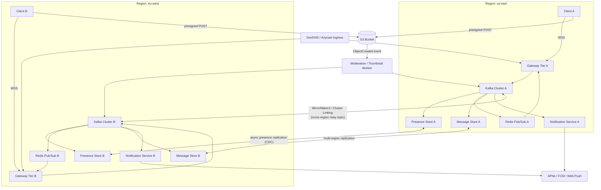

# Module 24: Scaling Chat Systems for Production

## Recap of the System Being Scaled

The previous module built a single-region real-time chat backbone: clients hold a persistent WebSocket to a stateless gateway tier; the gateway publishes inbound messages onto Kafka topics partitioned by conversation ID; a consumer group fans messages out through Redis Pub/Sub channels back to whichever gateway nodes hold the recipients' sockets; and a message-store service asynchronously persists history (e.g. Cassandra or DynamoDB) keyed for reverse-chronological reads. That design solves durability and fan-out within one region and one Redis/Kafka cluster, but it silently assumes every participant in a conversation is reachable from the same Redis instance and the same Kafka cluster — an assumption that collapses the moment users are spread across continents for latency reasons. This module removes that assumption and turns the single-region system into a multi-region, production-hardened service.

## Multi-Region Architecture & Traffic Routing

**Ingress routing.** Users connect to the region nearest them, chosen by GeoDNS or an anycast/Global Accelerator layer (AWS Global Accelerator, Cloudflare, or GCP's Global external HTTPS LB) rather than client-side region selection — this keeps WebSocket handshake and heartbeat RTT low and is invisible to the client, which just resolves one hostname. Each region runs a full copy of the stack from the previous module: gateway tier, Kafka cluster, Redis, and a regional replica (or shard) of the message store. A region is a fully functional unit — it does not depend on another region being up to serve users connected to it.

**Cross-region message delivery.** The hard requirement is: user A's message must reach user B even when B's gateway connection terminates in a different region than A's. Two mechanisms compose to do this:

1. **Global routing table.** A lightweight, globally-replicated (or globally-queryable) directory maps `user_id → region` for every currently-connected user. This is *not* the full presence store (see next section) — it can be a thin index with high read fan-out tolerance, e.g. DynamoDB Global Tables, a Cassandra keyspace with `NetworkTopologyStrategy` across regions, or a Redis cluster with cross-region replication (active-active via CRDTs, e.g. Redis Enterprise CRDB, or a simple last-writer-wins replica feed).
2. **Inter-region relay topic.** When the gateway in region A receives a message for a conversation with participants in region B, the region-A Kafka consumer that would normally just publish to region-A's Redis Pub/Sub instead (or additionally) publishes onto a **cross-region relay topic** — typically implemented with Kafka's MirrorMaker 2 (or Confluent Cluster Linking / AWS MSK Replicator) which replicates topics between regional Kafka clusters with a bounded, monitored lag. Region B consumes the mirrored topic, and its own local fan-out (Kafka → Redis Pub/Sub → gateway socket) delivers to B's connected client exactly as it would for a local message.

This gives an explicit, debuggable path: **client → local gateway → local Kafka → (if any participant is remote) cross-region topic mirror → remote Kafka → remote Redis Pub/Sub → remote gateway → remote client.** The routing table lookup happens once per message, at the producing region, to decide which regions need a mirrored copy — it is not looked up per-fan-out-recipient, which keeps the hot path cheap even for large group conversations spread across many regions.

**Write path for persistence.** The message store itself is also replicated (multi-region DynamoDB Global Tables, or a Cassandra ring stretched across regions) so history is available regardless of which region a client reconnects to later; this is a separate replication concern from the low-latency delivery path above and can tolerate looser consistency (eventual, seconds-level) since it only affects history backfill, not live delivery.

## Presence at Multi-Region Scale

**Why single-region sticky sessions break down.** In a single-region design it's tempting to make "presence" simply mean "this user has a live socket on gateway node N," tracked in that node's memory or a local Redis instance. This fails hard across regions for three concrete reasons:

1. **No global source of truth.** If Alice is connected to us-east and Bob is connected to eu-west, and Bob's client asks "is Alice online?", eu-west's local presence store has no idea — Alice's socket lives entirely in us-east's process memory or regional Redis. You'd need a full presence query to fan out to every region for every presence check, which does not scale and adds cross-region latency to what should be a near-instant status check.
2. **Multi-device, multi-region reality.** A single user routinely has sessions in more than one region concurrently (phone on cellular routed to one region, laptop on wifi routed to another during travel, or simply DNS/anycast routing two devices differently). "Online" is a property of the *user*, computed as an OR across all their sessions, and those sessions can legitimately be spread across regions — a per-node or per-region sticky view can only ever see its own slice and will report a user offline when they are in fact online elsewhere.
3. **Failure ambiguity.** With sticky, in-memory presence, a node crash or network partition is indistinguishable from a real disconnect from outside that node — there is no independent heartbeat signal once the node holding the state is gone, so downstream consumers (other regions, other services) either get stale "online" forever or delayed "offline" with no way to tell how stale the information is.

**The replacement design.** Presence is redesigned as an explicit, TTL-based, globally-visible fact store rather than an implicit property of a live socket:

- Each gateway node emits a **heartbeat** for every session it holds (e.g. every 15–30s, tied to the existing WebSocket ping/pong) as a write of the form `(user_id, session_id, region, device_type, last_seen) with TTL`. This is written to the *region-local* presence store (Redis with `EXPIRE`, or a table with TTL) — writes stay local and cheap, no cross-region round trip on every heartbeat.
- Regional presence stores are **replicated to every other region asynchronously**, either via a lightweight change-data-capture stream (Debezium/Kafka Connect off the presence store's WAL) or, if using Redis, via active-active geo-replication. Each region ends up with a merged, eventually-consistent view of *all* sessions for *all* users, tagged by region and TTL.
- Because it's TTL-based rather than delete-on-disconnect, a crashed node's sessions **expire naturally** within one heartbeat interval instead of requiring an explicit "someone tell everyone this node died" event — this directly solves the failure-ambiguity problem: absence of a fresh heartbeat *is* the offline signal, with a bounded staleness window equal to the TTL.
- Computed "is user online" is `EXISTS(any session for user_id with unexpired TTL, across all replicated regional feeds)` — a local read against the local merged replica, no cross-region synchronous call needed. This is functionally the same pattern Slack describes for their Presence Server tier (regional presence servers, clients subscribing only to the presence of users visible in their current view rather than global broadcast) and rhymes with how Discord treats presence as just another piece of per-guild fanout state distributed via consistent hashing across their Elixir cluster, deliberately kept as ephemeral, re-derivable state rather than durable ground truth.
- Presence *changes* (not just heartbeats) are pushed as events onto the same Kafka fan-out backbone used for messages, so subscribers watching a user's status get an active push rather than having to poll — this reuses infrastructure instead of building a second delivery system.

## Sticky Sessions Reconsidered

Sticky sessions do not go away — they get demoted from "correctness mechanism" to "performance optimization," and that distinction has to be explicit in the design so nobody re-introduces a hard dependency on them.

**Where affinity still matters operationally:**
- Keeping a user's WebSocket pinned to the same gateway node for the life of a session avoids repeated TLS/WebSocket handshake overhead and lets the gateway keep small amounts of hot connection state (compression contexts, batching buffers, rate-limit counters) in local memory instead of a shared store, which is meaningfully cheaper at high message rates.
- Load balancer affinity (consistent-hash on user ID or a cookie) reduces cross-node chatter for the *local* fan-out step: if a gateway node already holds the socket, delivering to it doesn't need an extra hop through Redis Pub/Sub for messages that originate and terminate on the same node.
- L4/L7 load balancer session affinity also make debugging and capacity planning easier — you can reason about "this node holds roughly N sessions" for autoscaling triggers.

**Where it must not be relied on for correctness:**
- Presence, as designed above, must be correct even if a user's session affinity is broken (reconnect during a deploy, node eviction, regional failover) — that's the entire point of moving it to a replicated, TTL-based store instead of node-local memory.
- Message delivery must not assume the recipient is on the node that produced the message — that's what Kafka + Redis Pub/Sub fan-out is for; sticky sessions are an optimization *inside* that fan-out (skip the pub/sub hop for a same-node delivery), never a substitute for it.
- Any sticky-session mechanism must have a well-tested fallback path: on gateway node failure or deploy-triggered connection drain, clients reconnect (with backoff and jitter) and get load-balanced to a new node, and the system must lose zero messages and re-establish correct presence within one TTL window — this is exactly the scenario a chaos experiment (below) should validate continuously, not just at initial launch.

## File Uploads via S3

**Chosen pattern: presigned direct upload, not proxying through the chat service.** Proxying every image/attachment byte through the chat service (gateway or a dedicated upload API) wastes compute and bandwidth on a tier that is provisioned and priced for many small, latency-sensitive WebSocket messages, not large binary payloads — and it adds a second, larger request body type to a service whose failure modes you want to keep narrow. The comparison of proxy vs. presigned-URL vs. presigned-POST approaches is well documented in practitioner write-ups (Zac Charles' comparison is a good reference): proxying is simplest to reason about but costs compute/bandwidth and hits gateway body-size limits; a bare presigned PUT URL is simple but has no server-side way to cap the uploaded object's size; a **presigned POST** additionally carries a signed policy document (content-type, key prefix, size range, expiration) that S3 itself enforces, closing the "client uploads a 50 GB file" abuse case without the chat service ever seeing the bytes.

**Concrete flow:**
1. Client calls the chat service's REST API: `POST /uploads/init` with `{conversation_id, filename, content_type, size}`.
2. The service authenticates and authorizes (is this user a participant in the conversation?), then generates a presigned POST policy scoped to a specific S3 key (e.g. `uploads/{conversation_id}/{uuid}/{filename}`), a bucket-and-prefix-scoped IAM role, `Content-Length-Range`, an allowed `Content-Type`, and a short expiry (1–5 minutes).
3. Client uploads directly to S3 using the returned fields — this traffic never touches the chat backend.
4. On successful upload, either (a) the client calls back `POST /messages` with the S3 key as an attachment reference and the service verifies via `HeadObject` that the object exists and matches expected size/type before accepting the message, or (b) — preferred for a stronger consistency guarantee against a client that never calls back — an S3 event notification (via SQS or EventBridge) on `ObjectCreated` triggers a small Lambda/worker that validates the object (virus scan, image re-encode/thumbnailing, moderation hook) and only then publishes the "attachment ready" message onto the same Kafka topic used for normal messages, so downstream fan-out and persistence are unchanged.
5. The message record stores a stable reference (S3 key + a CDN-fronted URL template, e.g. CloudFront in front of the bucket) rather than a raw signed URL — signed URLs expire, but the object reference must remain valid for the lifetime of the message; clients request a fresh signed *GET* URL (or use a public CDN URL behind auth) at render time.

This keeps the chat service's write path metadata-only (fast, small payloads) while S3 and its ecosystem (CloudFront, Lambda-on-event, S3 lifecycle rules for cost) does the heavy lifting for the actual bytes.

## Notification Pipeline

Push notifications for offline users are event-driven and deliberately reuse the same Kafka fan-out that drives live delivery, rather than being a bolted-on second system:

1. The same Kafka topic (or a derived topic populated by a stream processor) that the gateway's Redis Pub/Sub fan-out consumes from is also consumed by a **notification service** consumer group.
2. For each message event, the notification service checks the recipient's presence (using the presence store from above): if the user has **zero** active sessions across all regions, it's a candidate for push; if they have an active session but that session's client hasn't ack'd the message within a short window (e.g. app backgrounded), it's also a candidate — this second check needs a lightweight "delivered/read ack" back-channel from the client, typically piggybacked on the existing message-ack protocol.
3. The notification service looks up the user's registered push tokens (APNs/FCM/Web Push, stored per-device) and enqueues a push job onto a dedicated topic, decoupled from the hot message path so provider outages or rate limits on APNs/FCM never back-pressure message delivery itself.
4. A separate worker pool drains that topic and calls the provider APIs, with per-provider retry/backoff and dead-lettering for permanently-invalid tokens (which also triggers token cleanup).
5. De-duplication and batching matter here: a user offline across a burst of messages in one conversation should get one collapsed notification ("5 new messages from X"), not five pushes — this is done with a short debounce window (e.g. 5–10s) per (user, conversation) keyed in the presence/notification store, flushing a single summarized push per window.

This design means presence, message delivery, and notification are three consumers of the same event stream with different downstream effects, rather than three independently-built pipelines that can drift out of sync.

## Monitoring, Chaos Testing & Production Readiness

**Metrics and alerts specific to a multi-region real-time system** (beyond generic CPU/memory/error-rate):
- **Connection-level:** concurrent WebSocket connections per region/node, connection churn rate (connects+disconnects/sec), reconnect storm detection (sudden spike correlated with a deploy or node eviction), handshake latency p50/p99.
- **Fan-out latency:** end-to-end message latency broken into segments — producer→Kafka, Kafka→Redis Pub/Sub, Redis→gateway, gateway→socket-write — so a regression is localized to a specific hop; alert on p99 exceeding e.g. 300ms same-region / 800ms cross-region.
- **Cross-region replication lag:** MirrorMaker/Cluster Linking replication lag (messages) and presence-store replication lag (seconds) — both need hard alert thresholds, since delivery correctness and presence accuracy degrade directly with this lag.
- **Presence staleness:** rate of heartbeat writes vs. expected (session_count / heartbeat_interval), and TTL-expiry rate as a proxy for silent node death detection working correctly.
- **Kafka consumer lag** per consumer group (fan-out, notification, persistence) — the single most useful early-warning signal for a real-time system, since lag translates directly into user-visible delivery delay.
- **Upload pipeline:** presigned-URL issuance rate vs. actual S3 `ObjectCreated` completion rate (a large gap indicates abandoned uploads or a client-side bug), moderation/thumbnail worker queue depth.

**Chaos experiments worth running** (in a staging environment first, then controlled production game-days):
- Kill a region's presence store (or partition it from its replication feed) and verify: local presence checks still work (reads local replica), replication lag alert fires, and — critically — that no other region's message-delivery path silently depends on that presence store being healthy.
- Partition the cross-region Kafka mirror (simulate MirrorMaker falling behind or stopping) and verify same-region delivery is unaffected while cross-region delivery degrades gracefully (queued, not dropped) with an alert, and recovers without message loss once the partition heals.
- Kill a gateway node holding a known set of active sessions mid-conversation and verify: clients reconnect within expected backoff, presence reflects the outage within one TTL window, and no messages sent during the outage are lost (they should be sitting durably in Kafka regardless of gateway state).
- Inject latency (not just failure) on the presence replication feed to check for cascading effects like online/offline flapping in the UI.
- Fail an entire region (simulate a regional AWS/GCP outage) and verify GeoDNS/anycast reroutes new connections and that existing conversations with participants split across the failed and healthy regions degrade to "delayed delivery to the affected region's users" rather than a hard failure for everyone.

**Production readiness checklist (real-time specific):**
- [ ] Every hot-path dependency (Redis Pub/Sub, Kafka, presence store) has a documented failure mode and a corresponding chaos test that has actually been run, not just designed on paper.
- [ ] Presence correctness verified under network partition between regions (no permanent "stuck online").
- [ ] Reconnect storms are load-tested (e.g. simulate 100k clients reconnecting within 30s after a deploy) with backoff/jitter tuned so the auth service and gateway don't fall over.
- [ ] Cross-region replication lag has paged alerting with a runbook, not just a dashboard.
- [ ] Presigned upload size/type limits are enforced server-side (not just client-side) and validated by at least one production incident-style test (attempt an oversized/mismatched upload and confirm rejection).
- [ ] Notification de-duplication/debounce logic tested against burst scenarios (avoid notification spam complaints, a common real launch issue).
- [ ] Capacity plan documents connections-per-node ceiling and the autoscaling trigger tied to it, validated under load test, not assumed from a spec sheet.
- [ ] Rollback plan for a bad gateway deploy includes verified connection-draining behavior (no dropped in-flight messages).

## Updated Architecture Diagram

## Trade-offs and Alternatives Considered

- **Global active-active Kafka vs. per-region clusters + mirroring:** a single global Kafka cluster stretched across regions would simplify routing logic but ties message durability to cross-region network reliability for *every* message, not just cross-region ones, and WAN partitions would stall same-region traffic too. Per-region clusters with selective mirroring keep the common case (same-region delivery) immune to WAN issues.
- **Fully globally-consistent presence (single global store, e.g. a globally-distributed SQL database with synchronous replication) vs. regional-with-async-replication:** the fully consistent option gives zero staleness but adds cross-region write latency to every heartbeat and a hard availability dependency on every region for presence to function anywhere — rejected in favor of the TTL/eventually-consistent design, whose bounded staleness (one heartbeat interval) is an acceptable trade for regional independence.
- **Proxy uploads vs. presigned:** proxying was rejected for the reasons in the file-upload section, but it remains the simpler choice for a smaller-scale or single-region deployment where the added infrastructure (event notifications, worker pool) isn't yet justified.
- **Polling-based presence vs. push-based (chosen):** polling is simpler to build but doesn't scale to "who's online" queries needed for typing indicators and read receipts at chat-app volumes; push-based reuse of the Kafka backbone was chosen to avoid a second, bespoke delivery system.

## How Real Systems Solve This

Discord's Elixir-based gateway uses consistent hashing to map guilds and sessions onto specific nodes, and treats presence/session fanout as just another form of the same guild-broadcast problem it solves for messages — their well-documented scaling work (the "Manifold" library for batched cross-node sends, and "FastGlobal" for sub-microsecond consistent-hash ring lookups) exists specifically because presence and message fanout to large guilds created the same "publish to N remote nodes cheaply" bottleneck this module's design routes around via Kafka + regional Redis Pub/Sub. Slack's architecture separates these concerns into distinct server roles — Gateway Servers (WebSocket termination, geographically distributed), Channel Servers (consistent-hash-routed message brokering), and dedicated Presence Servers — and explicitly optimizes presence delivery by only pushing status for users currently visible in a client's UI rather than broadcasting globally, the same "don't pay for global broadcast when a narrower subscription will do" principle applied to the notification debounce design above.

## Sources

- [How Discord Scaled Elixir to 5,000,000 Concurrent Users](https://discord.com/blog/how-discord-scaled-elixir-to-5-000-000-concurrent-users)
- [How Discord Serves 15-Million Users on One Server (ByteByteGo)](https://blog.bytebytego.com/p/how-discord-serves-15-million-users)
- [Real-time Messaging | Engineering at Slack](https://slack.engineering/real-time-messaging/)
- [S3 Uploads — Proxies vs Presigned URLs vs Presigned POSTs, Zac Charles](https://zaccharles.medium.com/s3-uploads-proxies-vs-presigned-urls-vs-presigned-posts-9661e2b37932)
- [Implementing secure file uploads to Amazon S3 at the edge: Choosing the right pattern — AWS Networking & Content Delivery Blog](https://aws.amazon.com/blogs/networking-and-content-delivery/implementing-secure-file-uploads-to-amazon-s3-at-the-edge-choosing-the-right-pattern/)
- [The illustrated guide to S3 pre-signed URLs — fourTheorem](https://fourtheorem.com/the-illustrated-guide-to-s3-pre-signed-urls/)
- [Efficient S3 File Upload Pipeline with Presigned URLs, Event Triggers, and Lambda Processing — Bright Inventions](https://brightinventions.pl/blog/efficient-S3-file-uploads-with-async-processing/)
- [What is Chaos Engineering? Breaking Systems to Build Resilience — testRigor](https://testrigor.com/blog/what-is-chaos-engineering/)
- [Chaos Testing Guide: Chaos Engineering, Fault Injection, and Resilience Best Practices — Katalon](https://katalon.com/resources-center/blog/chaos-testing-a-complete-guide)
